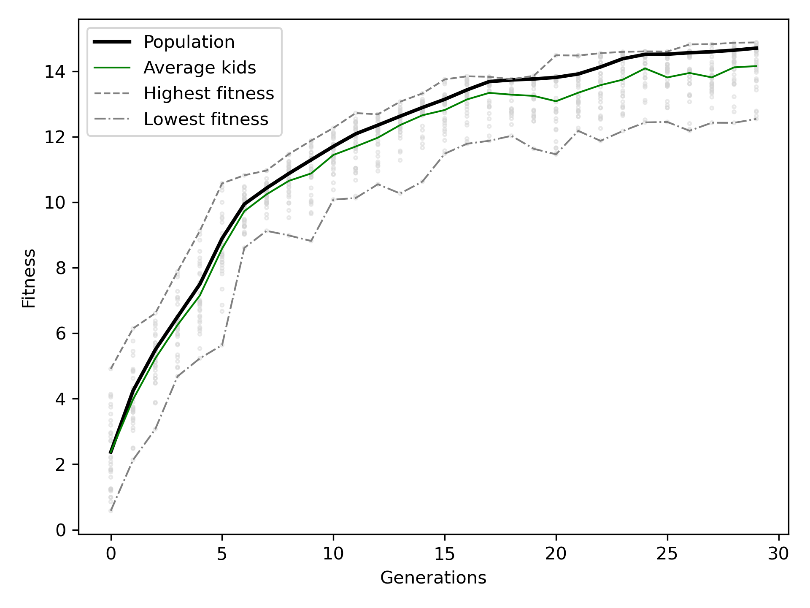
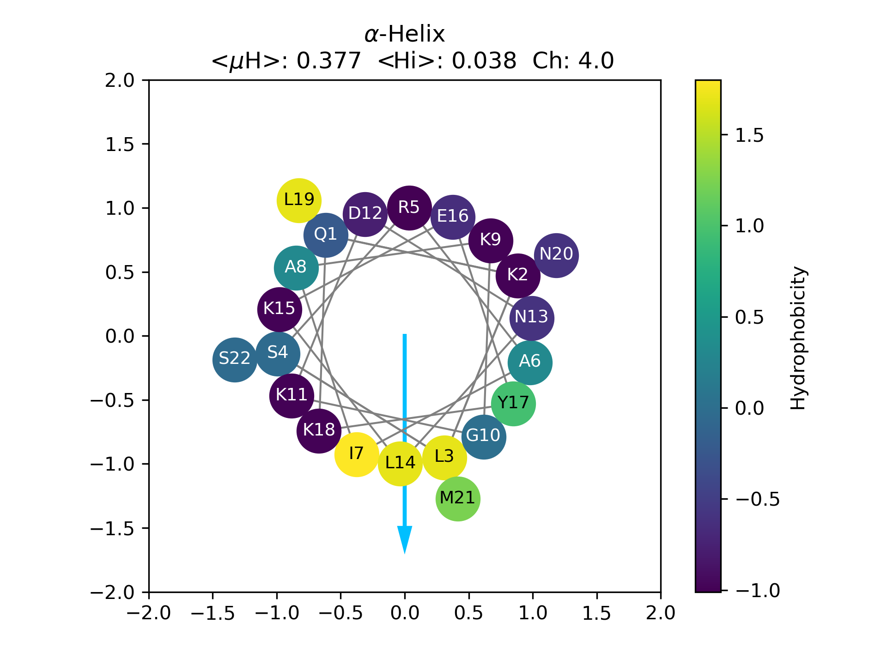
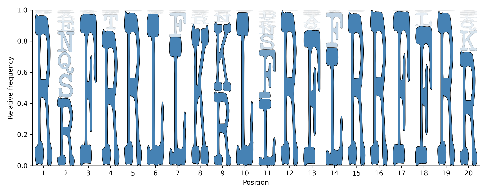
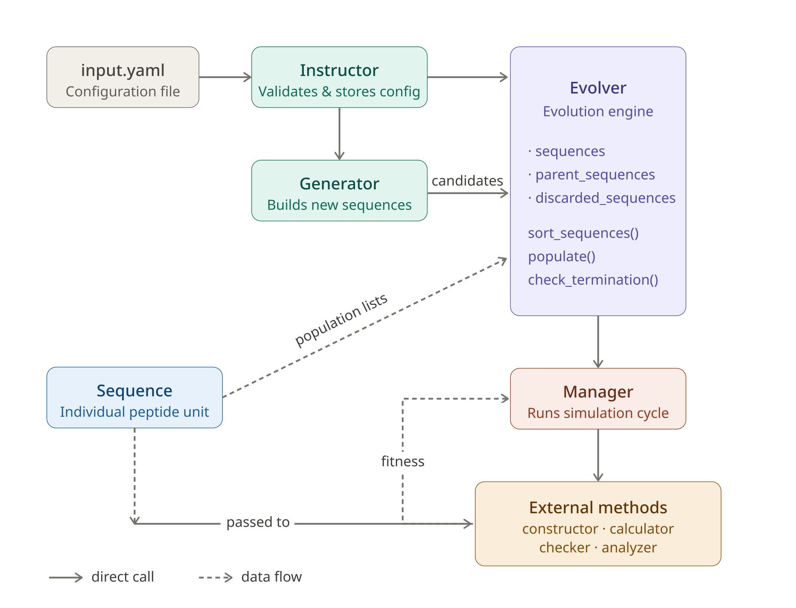

# Modular EvoMD implementation in python

EvoMD is an evolutionary optimization framework for peptide sequences. It evolves a population of peptides based on a user-defined fitness function evaluated via simulation modules written and plugged in by user. The configuration is stored in a single YAML file, and the state is serialized to evolver.pkl after every step.

The general process begins with a random population that is continuously evaluated and sorted. The worst performers are discarded, and the population is renewed through crossover of the best sequences. The result is an optimized population of sequences. 


---

## Dependencies

Python 3.10+ required.

```bash
pip install numpy pyyaml matplotlib
```

---

## Quickstart

This example uses `test_hm.py` (included), which maximizes the hydrophobic moment of 20-residue peptides with no real simulation.

**1. Create an `input.yaml` (or use file in test directory):**

```yaml
optimize: maximize  # maximize or minimize
population: 32  # how many sequences in the population?
peptide_len: 20  # peptide lenght
populate_method: swap  # hybrids and swap work better
extra_mutation: True  # Random point mutation
also_mutate_probability: 0.1  # 10% of the new sequences are mutated
parents_ratio: 0.25  # Parents are chosen from the 25% of the population

# User must write the name of the python script with the external methods.
# These are external methods. You can include all the methods in one file
# and define only calculator (see example in test/input.yaml).
constructor: test_hm  # script for contructing simulation box.
calculator:  test_hm  # running.
calculator_check: test_hm  # checking simulations.
analyzer:    test_hm  # Analysis and computation of fitness values.

sleep_time: 0
max_check_cycle: 50
max_generations: 30

hydrophobic_restriction: False  # restraints in hydrophobic moment
hydrophobic_min: null   # ignored while hydrophobic_restriction is False
hydrophobic_max: null   # no max limit

mut_aa: ADEFKLNQRSTY    # only these aa are used
```

**2. Create the Evolver:**

```bash
python evo-md.py --file input.yaml --create-evolver
```

**3. Run the evolution:**

```bash
python evo-md.py --start
```

**4. Inspect the results:**

```bash
python evo-md.py --show-evolver                # prints the final state of the process
python evo-md.py --report-sequences            # writes sequences_report.csv
python evo-md.py --plot-evolution --show-kids  # plots and saves as evolution.png
```

The plot shows the evolution of the population (black solid line). Green solid line is the average fitness of the kids
created in each generation. Highest and lowest fitness found in each generation are also presented.



**5. Plot sequences:**

You can use `peptide_viewer.py` to plot any sequence as $\alpha$-helix. You can show hydrophobic moment computed as described by [Eisenberg](https://doi.org/10.1073/pnas.81.1.140).

The example shows Opi1 peptide (`QKLSRAIAKGKDNLKEYKLNMS`).

```bash
python peptide_viewer.py --sequence QKLSRAIAKGKDNLKEYKLNMS
```

Do you want to see information as shown by [HeliQuest](https://heliquest.ipmc.cnrs.fr)? --> Change hydrophobicity scale and include the information that you need.

```bash
python peptide_viewer.py --sequence QKLSRAIAKGKDNLKEYKLNMS --print-hm --print-hi --print-ch --av-hm --h-scale fauchere-pliska
```



**6. Plot sequence logo:**

You can use `sequence_logo.py` to see the behavior of the primary sequences as a sequence logo. 
`sequence_logo.py` can read evolver.pkl or the CSV report created by `python evo-md.py --report-sequences`.

```bash
# plot the 25% of the sequences with highest hydrophobic moment
python sequence_logo.py --ratio 0.25 --gradient --group max --evopkl evolver.pkl
```




See the available options

```bash
python peptide_viewer.py --help
```

---

## How it works

Each generation EvoMD:

1. **Constructs** the simulation box (constructor_method).
2. **Runs** the simulation (calculator_method).
3. **Checks** if simulations finished (calculator_check).
4. **Analyzes** results and computes fitness (analyzer_method).
5. **Sorts** sequences, keeps the best as parents, and generates the next generation.

Users have the control of steps 1–4 by writing a Python plug-in with four functions and calling it in the YAML (see next section). EvoMD handles the rest.

The general idea of the modular architecture is shown in the next figure:



---

## Writing your own methods

Users must create Python modules with these four functions and name it in the YAML (`constructor`, `calculator`, `analyzer`). All three keys can point to the same file.

```python
def constructor_method(sequence) -> None:
    # Write input files, build the system, etc.
    pass

def calculator_method(sequence) -> None:
    # Launch the job (submit, start a process, etc.)
    pass

def calculator_check(sequence) -> bool:
    # Return True when the job is done, False otherwise.
    # Polled repeatedly by EvoMD until True or the cycle budget runs out.
    return True

def analyzer_method(sequence) -> float:
    # Parse results and return the fitness value.
    return 0.0
```

Each function runs inside the sequence's iteration directory. The `sequence` object gives the residue string (`str(sequence)`), physicochemical properties (`sequence.charge`, `sequence.residues`, …), and state flags (`sequence.is_failed` to mark a failure). You can attach arbitrary attributes to carry information between functions (e.g. a job ID set in `calculator_method` and read in `calculator_check`).

See `test_hm.py` for a short example.

---

## Common commands

| What you want to do | Command |
|---|---|
| Create a new Evolver and exit | `python evo-md.py --file input.yaml --create-evolver` |
| Start the evolution loop | `python evo-md.py --start` |
| Resume an interrupted iteration | `python evo-md.py --restart` |
| Show the current state | `python evo-md.py --show-evolver` |
| Export all sequences to CSV | `python evo-md.py --report-sequences` |
| Plot fitness over generations | `python evo-md.py --plot-evolution` |
| Roll back to the last complete generation | `python evo-md.py --last-generation` |

Run `python evo-md.py --help` for the full flag reference.

---

## Output files

| File | Description |
|---|---|
| `evolver.pkl` | Full Evolver state, updated after each step. |
| `sequences_report.csv` | All sequences with generation and fitness. |
| `evolution.png` | Fitness plot (written by `--plot-evolution`). |
| `simulation_data/<SEQUENCE>/iter_N/` | Per-sequence, per-attempt directories where your methods run. |

---

## Recovery

If a run is interrupted:

```bash
python evo-md.py --restart
```

If the last generation is incomplete or just want to go back to the last completed generation:

```bash
python evo-md.py --last-generation
```

Then continue with `--start`.

---

## Update version

Use the old version to create a sequence report in CSV format.

```bash
python scripts_old/evo-md.py --report-sequences
```

Update input.yaml with new variable names (some variables were refactores for better comprehention).

Create evolver.pkl and read report with the new version.

```bash
python scripts_new/evo-md.py --create-evolver --file input.yaml --read-report sequence_report.csv
```

Start evolution with the new version

```bash
python scripts_new/evo-md.py --start
```

---

## Running on LUMI

You can run evo-md using a LUMI container wrapper.
The next instructions were adapted from [LUMI Documentation](https://docs.lumi-supercomputer.eu/software/installing/container-wrapper/)

Load the LUMI container module.

```bash
module load LUMI
module load lumi-container-wrapper
```

Create a conda environment file (e.g. env.yml).

```
# --- env.yml ---
channels:
  - conda-forge

dependencies:
  # Dependencies for evo-md
  - python>=3.10
  - numpy
  - pyyaml
  - matplotlib

  # Include dependencies for your
  # external methods (constructor, calculator, analyzer)
  # e.g. scipy, pymol, vermouth, biopython, etc.
  - pymol-open-source
  - vermouth
```

Create the directory for the container (e.g. env/) and create the container.

```bash
mkdir env
conda-containerize new --prefix env env.yml
```

Execute python from the container.

```bash
/users/USER/env/bin/python /users/USER/modular_evomd/evo-md.py --help
```

## Populating from backup

You can populate Evolver from the json files created after each generation.
First step is to create a **new evolver** using an input file with an adequate configuration (be sure that peptide_len is equal to the length of the sequences in the backup).

Then populate from backup:

```bash
python evo-md.py --from-backup
```

This creates sequences from json files in simulation directory and sort the sequences. The result is an evolver with choosen parents ready to start.

```bash
python evo-md.py --start
```
